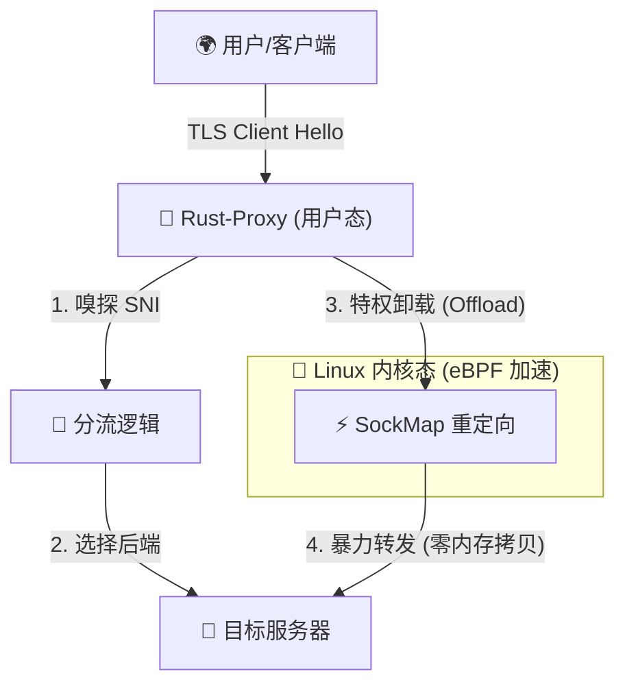

# 🏗️ Rust-Proxy 技术架构与设计逻辑

> **设计哲学**: “让数据包在内核中原地瞬移”。

---

## 1. 宏观物理架构 (Physical Architecture)

项目采用 **用户态管理 + 内核态加速** 的协同模式。

## 2. 软件设计模式 (Software Design)

项目遵循 **DDD (领域驱动设计)** 原则，代码分层极其清晰，以便模块化扩展。

- **Domain Layer (`domain/`)**: 零拷贝协议解析专家。负责 SNI 的精准提取，不产生任何堆内存分配。
- **Infrastructure Layer (`infra/`)**: 硬件调优专家。封装了 `io_uring` 运行时及内核级 Socket 调优参数（SO_REUSEPORT, TCP_QUICKACK）。
- **Application Layer (`application/`)**: 业务流程编排者。处理连接池管理、健康检查及 eBPF 模块的加载/下沉逻辑。

## 3. 核心科技模块 (Tech Modules)

### 3.1 异步运行时: Monoio (io_uring)
不同于传统的 `tokio` (多线程窃取模型)，我们选择 `monoio` 的 **Thread-per-core** 模型。每个线程绑定一个 CPU 核心，拥有独立的 `io_uring` 实例。这彻底消除了跨线程同步的开销。

### 3.2 内核加速器: Aya (eBPF)
通过 **SockMap** 技术，我们绕过了用户态的 3 次上下文切换：
1. `read()` 系统调用 (内核 -> 用户) - **消除**
2. 内部逻辑拷贝 - **消除**
3. `write()` 系统调用 (用户 -> 内核) - **消除**

数据流直接在内核态的 Socket 缓冲区之间完成“原地映射”。

## 4. 暴力提速标准 (Speed Standards)

| 技术环节 | 调优手段 | 性能增益 |
| :--- | :--- | :--- |
| 连接接收 | SO_REUSEPORT | 多核并行 Accept，吞吐翻倍 |
| 数据传输 | io_uring | 零上下文切换 I/O |
| 持久连接 | eBPF SockMap | 中继阶段零拷贝，延迟降低 80% |
| 二进制优化 | x86-64-v3 | AVX2 指令集暴力加持 |

## 5. 部署与运维架构 (Deployment & Operations)

为了适应生产环境，我们实现了 **Systemd 集成自动化**。

- **权限隔离**：通过 `CapabilityBoundingSet` 仅授予 `CAP_NET_ADMIN` 和 `CAP_NET_RAW`，遵循最小特权原则。
- **配置管控**：全局配置文件统一存放于 `/etc/rust-proxy/`，实现配置与程序的解耦。
- **生命周期管理**：利用 Systemd 的 `Restart=always` 机制，结合 eBPF 的状态脱离能力，确保即使主进程崩溃，内核态的过滤逻辑依然能保持基础防御。

---

> [!TIP]
> **AI 参考指引**: 当你在添加新功能（如统计报表）时，务必考虑异步观察者模式，避免在核心转发路径上引入阻塞。
